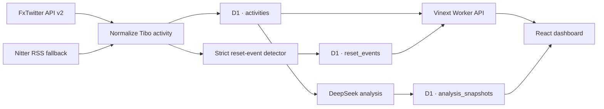

# Tibo Signal Desk

[中文文档](README_ZH.md) · **English**


A bilingual, single-page intelligence dashboard for following [Tibo (@thsottiaux)](https://x.com/thsottiaux) across X. It tracks his posts and conversations over a rolling seven-day window, estimates whether a Codex usage-limit reset may be approaching, and preserves verified reset announcements as structured history.

**Production:** [tibo-signal-desk.mumten120.chatgpt.site](https://tibo-signal-desk.mumten120.chatgpt.site) — currently an owner-only ChatGPT Sites deployment.


## Why this project exists

Tibo's reset announcements rarely live in a clean official changelog. They appear among original posts, replies, quotes, jokes, and conversations. Tibo Signal Desk turns that noisy public stream into three useful layers:

1. **Activity:** what Tibo posted and who he interacted with during the last seven UTC days.
2. **Signal:** a lightweight AI assessment of whether another reset looks imminent.
3. **Evidence:** a durable list of announcements where Tibo explicitly said a reset was completed or propagating.

The probability card is intentionally playful and is not official OpenAI guidance. Every historical reset row links back to the source post.

## Product highlights

- Rolling seven-day totals for original posts, replies, quotes, and reposts.
- Interaction-aware records that retain the account Tibo replied to or quoted.
- Daily activity rhythm and interaction-mix visualizations.
- DeepSeek-powered Codex / ChatGPT Work reset-signal analysis.
- Reset-aware analysis that starts after the latest confirmed global reset instead of reusing the whole seven-day feed.
- Server-owned, cached analysis snapshots: visitors cannot submit arbitrary model input, and unchanged evidence does not spend another DeepSeek request.
- A “since the previous analysis” explanation and an optional personal reset countdown stored only in the visitor's browser.
- Verified reset history with `completed` and `rolling_out` states.
- Durable Sites D1 storage with idempotent writes and fetch-run health records.
- FxTwitter API v2 as the primary source, with Nitter RSS as a fallback.
- Chinese and English UI, responsive layouts, keyboard focus, and reduced-motion support.
- Graceful stale-data mode when upstream public services are unavailable.

## Screenshots

### Reset radar and verified history

The history panel lives directly below the reset-likelihood card. It excludes teasers, jokes, and unsupported guesses, and keeps the original announcement link visible. The main dashboard screenshot above shows the hero and seven-day overview; this view focuses on the evidence layer.


## Architecture



| Layer | Technology |
| --- | --- |
| UI | React 19, TypeScript, Vinext |
| Runtime | ChatGPT Sites / Cloudflare Worker |
| Primary source | FxTwitter API v2 with replies enabled |
| Fallback source | Nitter `with_replies` RSS |
| Persistence | Sites D1 / SQLite |
| Signal analysis | DeepSeek Chat Completions API |

## Reset-history methodology

An activity becomes a reset event only when all of the following are true:

- the author is Tibo;
- the text concerns Codex, ChatGPT Work, usage limits, or rate limits;
- it explicitly says the reset was completed or is actively propagating;
- it is not merely a future promise, joke, conditional statement, or unrelated use of the word “reset.”

Events are classified by delivery (`completed` or `rolling_out`), type (`global` or `banked`), and audience scope. Curated historical evidence seeds the database, while newly fetched activities are checked automatically.

OpenAI's Codex App Server can expose an authenticated account's current usage percentage, window duration, next scheduled reset timestamp, and available reset credits through `account/rateLimits/read`. It does **not** provide a public history of Tibo-triggered global resets, so this project uses source-linked public announcements for that timeline. See the [official rate-limit fields](https://learn.chatgpt.com/docs/app-server#6-rate-limits-chatgpt).

### Reset-aware probability model

The activity dashboard still shows a rolling seven-day view, but the probability model uses a dynamic evidence window:

1. The latest confirmed global reset closes the previous window. Its announcement cannot be counted as evidence for the next reset.
2. Only newer posts, replies, and quotes reach the semantic analysis.
3. A seven-day weekly-window proxy adds gradual cadence pressure. It is explicitly an estimate because the public site cannot read a visitor's account-level `resetsAt` value. Official guidance describes a shared five-hour window and notes that additional weekly limits may apply.
4. A reset within the last 24 hours normally activates a cooldown and caps unsupported high predictions.
5. A new explicit reset promise, conflict, outage, celebration, or operational trigger can override that cooldown. Historical global-reset intervals of 24 hours or less are counted to show that rapid repeats are possible.

The result includes the post-reset activity count, weekly proxy progress, short-interval precedent count, and any deterministic guardrail applied to the model output. See the [official Codex usage-window description](https://learn.chatgpt.com/docs/pricing#what-are-the-usage-limits-for-my-plan).

## Data model

| Table | Purpose |
| --- | --- |
| `activities` | Normalized X activities keyed by status ID, including type, target handle, source, and publication time. |
| `fetch_runs` | Refresh attempts, source, item count, success state, and diagnostic error text. |
| `reset_events` | Durable verified reset events with status, kind, scope, evidence text, and source URL. |
| `analysis_snapshots` | Input fingerprint, model/prompt version, context, result, comparison metadata, and the subsequent reset outcome when known. |

Activity rows older than 30 days may be pruned because the product window is seven days. Verified reset events are stored separately and are not removed by that activity-retention rule.

## Getting started

### Requirements

- Node.js 22.13 or newer
- npm
- A DeepSeek API key for the reset-likelihood analysis (the activity dashboard still has a clear failure state when analysis is not configured)

### Environment

Copy `.env.example` to `.env` and provide your key:

```dotenv
DEEPSEEK_API_KEY=your_key_here
DEEPSEEK_BASE_URL=https://api.deepseek.com
ACTIVITY_SOURCES=fxtwitter,nitter
FXTWITTER_BASE_URL=https://api.fxtwitter.com
X_HANDLE=thsottiaux
NITTER_INSTANCES=https://nitter.net,https://nitter.poast.org,https://nitter.privacyredirect.com
REFRESH_TTL_SECONDS=600
REFRESH_SECRET=replace_with_a_long_random_value
```

FxTwitter does not require an X login, cookie, OAuth token, or project API key. Public Nitter instances are less reliable and remain a best-effort fallback. Never commit a real API key.

### Install and run

```bash
npm ci
npm run dev
```

Open the local URL printed by Vinext, normally `http://localhost:3000`.

### Validate

```bash
npm run build
```

After changing the D1 schema, generate and inspect a migration before building:

```bash
npm run db:generate
```

## API

| Endpoint | Method | Description |
| --- | --- | --- |
| `/api/activities/recent` | `GET` | Refreshes sources according to the cache policy, writes D1, and returns activity, seven-day statistics, coverage, and recent reset history. |
| `/api/activities/recent?refresh=1` | `GET` | Forces a refresh only with an authorized bearer token; visitors receive `403`. |
| `/api/analyze` | `GET` | Reads server-owned D1 activity, reuses or creates an auditable analysis snapshot, and returns the change from the previous snapshot. |
| `/api/refresh` | `POST` | Scheduler-ready refresh endpoint protected by `Authorization: Bearer $REFRESH_SECRET`. |

Abbreviated dashboard response:

```json
{
  "range": { "days": 7, "start": "2026-08-03", "end": "2026-08-09" },
  "stats": { "total": 49, "originals": 7, "interactions": 42 },
  "daily": [],
  "activities": [],
  "resetContext": {
    "analysisWindowStart": "2026-08-08T20:29:22.000Z",
    "postResetActivityCount": 6,
    "weeklyProgressPercent": 7,
    "rapidRepeatCount30d": 1,
    "explicitPostResetSignal": true
  },
  "resetHistory": [
    {
      "id": "2086188036493344823",
      "kind": "global",
      "status": "completed",
      "scope": "paid_codex_chatgpt_work",
      "evidenceUrl": "https://x.com/thsottiaux/status/2086188036493344823"
    }
  ],
  "coverage": { "oldestDay": "2026-08-03", "storedCount": 49, "complete": true }
}
```

## Project structure

```text
app/                       React page, styling, and Worker API routes
db/                        D1 schema, storage, caching, and aggregation
drizzle/                   Generated SQLite migrations and snapshots
lib/                       Source adapters, reset detector, reset-aware analysis, and shared types
worker/                    Vinext Worker entrypoint
public/                    Runtime visual assets and social preview
docs/images/               README screenshots captured from production
.openai/hosting.json       Sites project and logical D1 binding
client/ + server/          Pre-migration Vue / Express implementation
```

## Deployment

The repository root is the active ChatGPT Sites project. Vinext produces Cloudflare Worker-compatible ESM, `.openai/hosting.json` declares the logical `DB` binding, and hosted secrets are configured in Sites rather than committed to Git.

The current deployment remains private. Changing its audience or making it public should be treated as a separate access-control decision.

## Data boundaries and reliability

- “Interactions” means replies, quotes, and reposts; likes are not treated as communication messages.
- Statistics use UTC calendar days: today plus the previous six days.
- FxTwitter and Nitter are third-party, unofficial X data sources without an availability SLA.
- D1 caching and fallback behavior improve continuity but cannot guarantee complete X coverage.
- Reset likelihood is an entertainment-oriented signal, not a statement from OpenAI.
- Reset history is evidence-backed but depends on public posts remaining available.

More background is available in [X data-source evaluation](docs/x-data-sources.md) and the [ChatGPT Sites migration notes](docs/sites-migration.md).

## License

MIT
