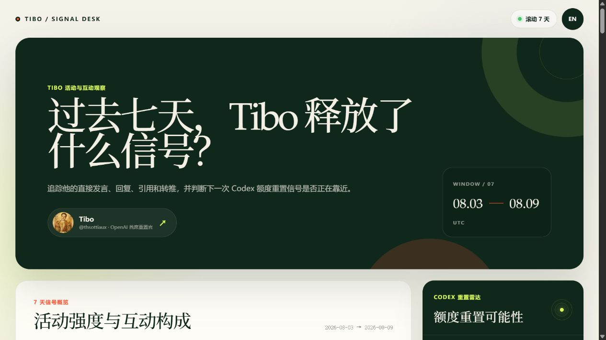
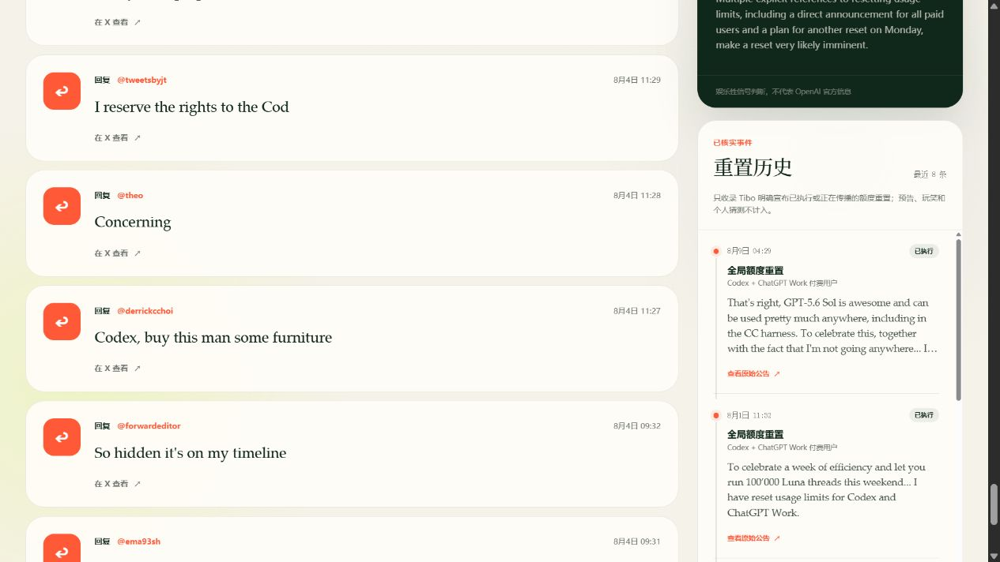
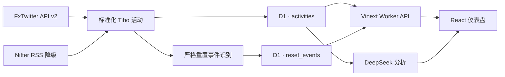

# Tibo Signal Desk

**中文文档** · [English](README.md)


一个双语、单页面、由 D1 持久化的数据观察仪表盘。项目追踪 [Tibo（@thsottiaux）](https://x.com/thsottiaux) 过去 7 天在 X 上的公开发言和互动，判断 Codex 额度重置是否可能临近，并把可核实的重置公告保存为结构化历史。

**线上站点：** [tibo-signal-desk.mumten120.chatgpt.site](https://tibo-signal-desk.mumten120.chatgpt.site) — 当前为仅所有者可访问的 ChatGPT Sites 私有部署。



## 为什么要做这个项目

Tibo 的重置公告并不存在于一份整洁的官方日志里，它们散落在直接发言、回复、引用、玩笑和对话之间。Tibo Signal Desk 将这些公开信息整理成三个层次：

1. **活动：** 过去 7 个 UTC 自然日里 Tibo 说了什么、与谁互动。
2. **信号：** 用轻量 AI 分析判断下一次重置是否可能临近。
3. **证据：** 持久保存 Tibo 明确表示“已经重置”或“正在传播”的公告。

“额度重置可能性”是娱乐性质的信号判断，并非 OpenAI 官方结论；历史记录中的每一项都会链接回原始发言。

## 功能亮点

- 统计滚动 7 天内的直接发言、回复、引用和转推。
- 保存 Tibo 回复或引用的对象，而不只统计他的独立发言。
- 展示每日活动节奏和互动类型构成。
- 使用 DeepSeek 分析 Codex / ChatGPT Work 重置信号。
- 提供带有“已执行”和“传播中”状态的可核实重置历史。
- 使用 Sites D1 幂等保存活动、重置事件和抓取健康记录。
- FxTwitter API v2 作为主数据源，Nitter RSS 作为降级来源。
- 中文 / 英文切换、响应式布局、键盘焦点和减少动画支持。
- 上游公共服务不可用时继续展示 D1 已保存数据。

## 页面截图

### 重置雷达与可核实历史

历史面板位于“额度重置可能性”下方。预告、玩笑和缺乏证据的猜测不会进入历史，每条记录都保留原始公告链接。文档开头的截图展示首屏和 7 天概览，下图则聚焦证据层。



## 技术架构



| 层级 | 技术 |
| --- | --- |
| 前端 | React 19、TypeScript、Vinext |
| 运行环境 | ChatGPT Sites / Cloudflare Worker |
| 主数据源 | FxTwitter API v2，启用回复数据 |
| 降级来源 | Nitter `with_replies` RSS |
| 结构化存储 | Sites D1 / SQLite |
| 信号分析 | DeepSeek Chat Completions API |

## 重置历史判定方法

只有同时满足以下条件的活动才会成为重置事件：

- 作者确实是 Tibo；
- 内容涉及 Codex、ChatGPT Work、usage limits 或 rate limits；
- 明确表示重置已经完成，或正在向用户传播；
- 不是未来预告、玩笑、条件句，也不是与额度无关的“reset”。

事件会按照执行状态（`completed` / `rolling_out`）、类型（`global` / `banked`）和覆盖对象分类。数据库预置了经过人工核实的历史证据，之后每次抓取的新活动也会自动经过同一套规则。

OpenAI 的 Codex App Server 可以通过 `account/rateLimits/read` 返回已登录账户的当前使用比例、窗口时长、下一次常规重置时间以及可用的手动重置额度，但没有提供 Tibo 全局重置的公共历史接口。因此，本项目使用带原始链接的公开公告建立时间线。参见 [OpenAI 官方额度字段说明](https://learn.chatgpt.com/docs/app-server#6-rate-limits-chatgpt)。

## D1 数据模型

| 数据表 | 用途 |
| --- | --- |
| `activities` | 以 X status ID 为主键的标准化活动，包含类型、互动对象、来源和发布时间。 |
| `fetch_runs` | 保存抓取来源、条数、成功状态和诊断错误。 |
| `reset_events` | 持久保存状态、类型、覆盖对象、证据文本和来源链接。 |

由于产品主要展示 7 天窗口，超过 30 天的普通活动可以被清理；重置事件存放在独立表中，不受普通活动清理规则影响。

## 本地运行

### 环境要求

- Node.js 22.13 或更新版本
- npm
- 用于重置可能性分析的 DeepSeek API Key（未配置时，活动统计仍有明确的错误状态）

### 环境变量

复制 `.env.example` 为 `.env`，并填写自己的 Key：

```dotenv
DEEPSEEK_API_KEY=your_key_here
DEEPSEEK_BASE_URL=https://api.deepseek.com
ACTIVITY_SOURCES=fxtwitter,nitter
FXTWITTER_BASE_URL=https://api.fxtwitter.com
X_HANDLE=thsottiaux
NITTER_INSTANCES=https://nitter.net,https://nitter.poast.org,https://nitter.privacyredirect.com
REFRESH_TTL_SECONDS=600
```

FxTwitter 不需要 X 登录、Cookie、OAuth 或项目 API Key。公共 Nitter 实例可靠性较低，只作为尽力而为的降级来源。不要提交真实密钥。

### 安装与启动

```bash
npm ci
npm run dev
```

打开 Vinext 输出的本地地址，通常是 `http://localhost:3000`。

### 验证

```bash
npm run build
```

修改 D1 schema 后，需要先生成并检查迁移：

```bash
npm run db:generate
```

## API

| 端点 | 方法 | 说明 |
| --- | --- | --- |
| `/api/activities/recent` | `GET` | 按缓存策略刷新数据源、写入 D1，并返回活动、7 天统计、覆盖范围和最近重置历史。 |
| `/api/activities/recent?refresh=1` | `GET` | 请求绕过常规新鲜度窗口进行刷新。 |
| `/api/analyze` | `POST` | 分析传入的非转推 Tibo 活动是否包含重置信号。 |

简化后的仪表盘返回示例：

```json
{
  "range": { "days": 7, "start": "2026-08-03", "end": "2026-08-09" },
  "stats": { "total": 49, "originals": 7, "interactions": 42 },
  "daily": [],
  "activities": [],
  "resetHistory": [
    {
      "id": "2086188036493344823",
      "kind": "global",
      "status": "completed",
      "scope": "paid_codex_chatgpt_work",
      "evidenceUrl": "https://x.com/thsottiaux/status/2086188036493344823"
    }
  ],
  "coverage": { "oldestDay": "2026-08-03", "storedCount": 49, "complete": true }
}
```

## 项目结构

```text
app/                       React 页面、样式和 Worker API 路由
db/                        D1 schema、存储、缓存和聚合
drizzle/                   生成的 SQLite 迁移和快照
lib/                       数据源适配、重置识别和共享类型
worker/                    Vinext Worker 入口
public/                    运行时图片与社交分享图
docs/images/               从线上页面截取的 README 图片
.openai/hosting.json       Sites 项目与 D1 逻辑绑定
client/ + server/          迁移前的 Vue / Express 实现
```

## ChatGPT Sites 部署

仓库根目录是当前有效的 ChatGPT Sites 工程。Vinext 生成 Cloudflare Worker 兼容 ESM，`.openai/hosting.json` 声明逻辑 `DB` 绑定，线上密钥通过 Sites 环境变量配置，不写入 Git。

当前部署保持私有。调整访问对象或公开站点应当作为单独的访问控制决策处理。

## 数据边界与可靠性

- “互动”指回复、引用和转推；点赞不作为沟通消息统计。
- 统计按 UTC 自然日计算：当天加之前 6 天。
- FxTwitter 和 Nitter 都是第三方、非官方 X 数据源，没有可用性 SLA。
- D1 缓存和降级机制可以提高连续性，但不能保证完整覆盖 X 数据。
- 重置可能性是娱乐性信号，不代表 OpenAI 官方立场。
- 重置历史有公开证据支持，但仍依赖原始帖子持续可访问。

更多背景参见 [X 数据源评估](docs/x-data-sources.md)和 [ChatGPT Sites 迁移记录](docs/sites-migration.md)。

## License

MIT
